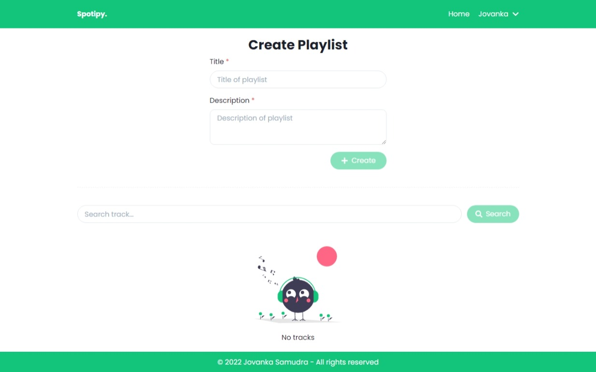
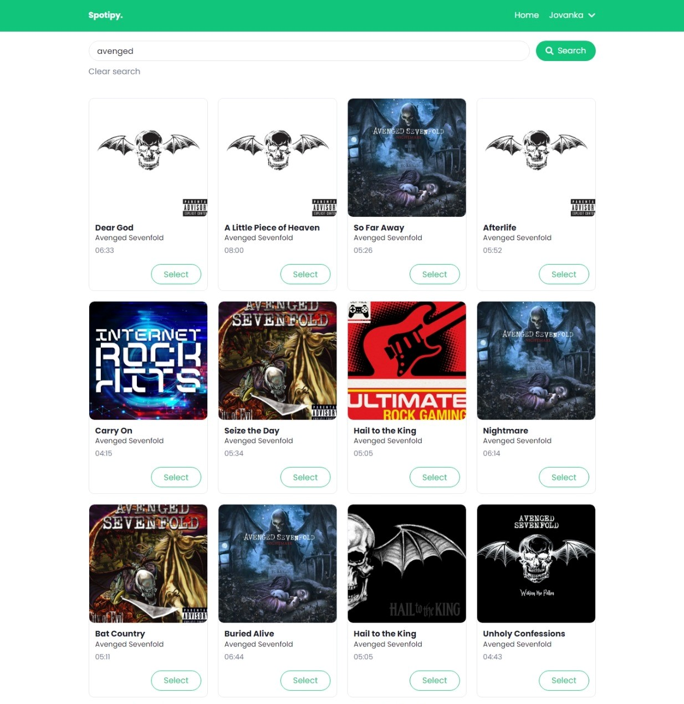

# Spotipy

> Spotipy is a place where you can connect with your spotify to create playlists.




## Features

- 🎵 Search music
- 🎶 Create playlist
- 😎 See user profile
- 🌙 Dark mode

## Powered by

- [Create React App](https://create-react-app.dev/) to initialize the project.
- [React Redux](https://react-redux.js.org/) to manage the app state.
- [Chakra-ui](https://chakra-ui.com/docs/getting-started) + [Framer Motion](https://www.framer.com/motion/) to build the user interface.
- [Jest](https://jestjs.io/) & [react testing-library](https://testing-library.com/) to test the UI and implementation. 🧪
- Hosted on [Vercel 🚀](https://vercel.com/).

## How to run on local

- Clone this project

    ```bash
    git clone https://github.com/samudrajovanka/spotify-app.git
    ```

- Go to the project folder

    ```bash
    cd spotify-app
    ```

- Install dependencies

    ```bash
    npm install
    ```

- Setup environment variables

    Create file with name `.env.local` and add the following content:

    ```env
    REACT_APP_SPOTIFY_CLIENT_ID = <your spotify client id>
    ```

- Run the server

    ```bash
    npm start
    ```

- Open <http://localhost:3000> with your browser to see the result.

## Author

Jovanka Samudra
